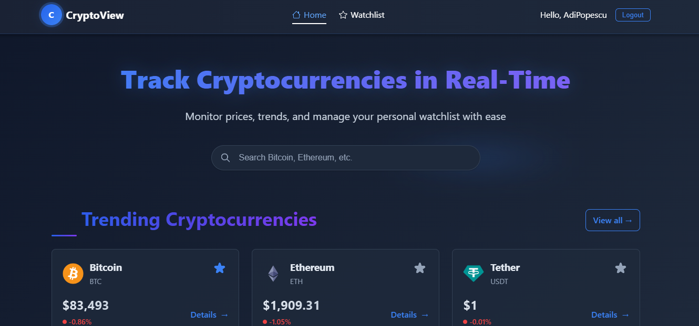
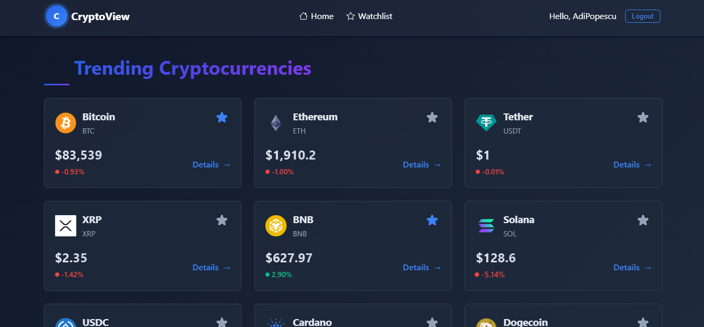
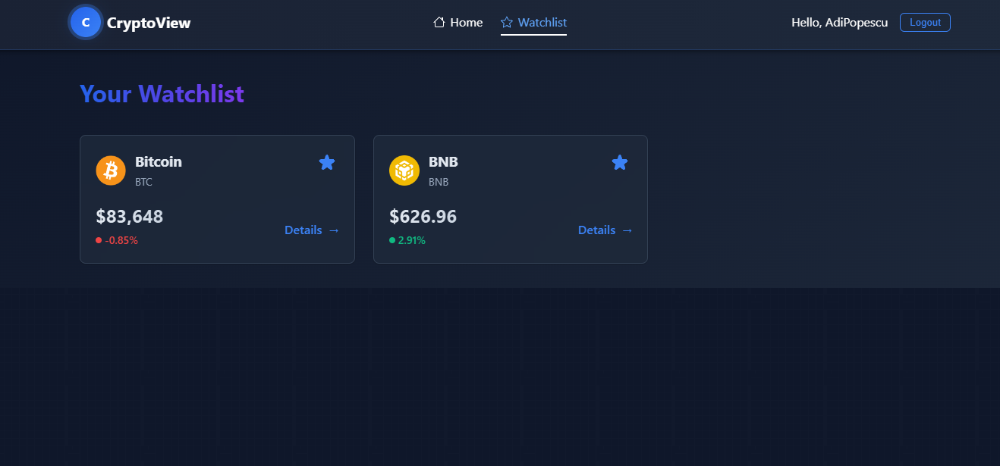
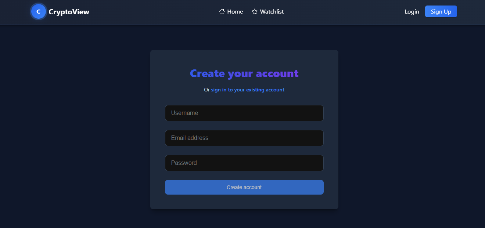

# Coin-Track

A cryptocurrency tracking application built with **Angular** for the frontend and **Spring Boot** for the backend. This application allows users to monitor cryptocurrency prices, create watchlists, and view detailed information about different cryptocurrencies.

## Features

- **User Registration & Login**: Secure authentication system.
- **Cryptocurrency Tracking**: View real-time data about various cryptocurrencies.
- **Watchlist**: Add cryptocurrencies to your personal watchlist for quick access.
- **Trending Cryptocurrencies**: View trending coins in the market.
- **Detailed Information**: Access comprehensive details about each cryptocurrency.
- **Search Functionality**: Easily find cryptocurrencies by name or symbol.

## Technologies Used

### Frontend (Angular)

- Angular 17
- Angular Forms (Reactive Forms)
- Angular Routing
- HTTP Client for API communication

### Backend (Spring Boot)

- Spring Boot 3
- MySQL Database
- Spring Data JPA
- Spring Web
- Spring WebFlux for reactive programming
- Project Lombok

## Screenshots
**Screenshot 1: Home Page**  


**Screenshot 2: Trending**  


**Screenshot 3: Watchlist**  


**Screenshot 4: Authentication**  


## Installation

### Backend Setup (Spring Boot)

1. Clone the repository:
   ```sh
   git clone https://github.com/PopescuAdrianIulian/Coin-Track
   cd Coin-Track/crypto-backend
   ```
2. Configure the database in `application.properties`:
   ```properties
   spring.datasource.url=jdbc:mysql://localhost:3306/coin_track
   spring.datasource.username=root
   spring.datasource.password=yourpassword
   ```
3. Run the backend:
   ```sh
   mvn spring-boot:run
   ```

### Frontend Setup (Angular)

1. Navigate to the frontend folder:
   ```sh
   cd ../crypto-frontend
   ```
2. Install dependencies:
   ```sh
   npm install
   ```
3. Run the Angular development server:
   ```sh
   ng serve
   ```
4. Open your browser and go to `http://localhost:4200`.

## API Endpoints

| Endpoint                      | Method | Description                            |
| ----------------------------- | ------ | -------------------------------------- |
| `/api/users/register`         | POST   | Register a new user                    |
| `/api/users/login`            | POST   | Log in to the app                      |
| `/api/cryptocurrencies`       | GET    | Fetch all cryptocurrencies             |
| `/api/cryptocurrencies/{id}`  | GET    | Retrieve details of a cryptocurrency   |
| `/api/watchlist`              | GET    | Get user's watchlist                   |
| `/api/watchlist`              | POST   | Add a cryptocurrency to watchlist      |
| `/api/watchlist/{id}`         | DELETE | Remove a cryptocurrency from watchlist |

## Usage

1. **Register** an account or log in.
2. Browse the **home page** to see cryptocurrency listings.
3. Use the **search** feature to find specific cryptocurrencies.
4. View **trending** cryptocurrencies.
5. Add cryptocurrencies to your **watchlist** for easy tracking.
6. Click on a cryptocurrency to view **detailed information**.
7. **Logout** when you're done.
